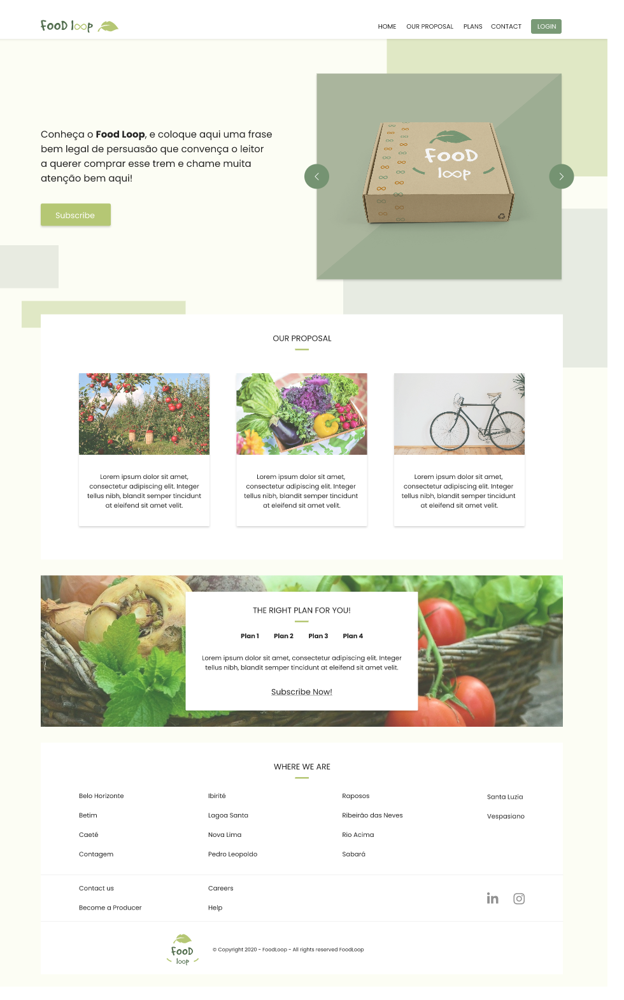

# IBM Call for Code - 2020 
## Climatic Changes

### Problem
The agricultural industry is one of the largest in the world. In 2019 it reached an aggregated value of 3 Trillions USD. Nowadays, agriculture is responsible, globally, for 70% of the use of freshwater. To keep its production, it is estimated that by 2050, this use will have an 15% increase. The way we grow our food contributes to 24% of global greenhouse gas emissions. Animal agriculture, contributes to 14% and food waste and loss to 8%.

This system is harmfull for the ecossystem and inneficient, as a a significant part* of the world population still suffers from undernourishment [*source http://www.fao.org/publications/sofi/en/ ]

### Solutions
Different food system already exists around the world. One particular efficient one is the Community-Supported Agriculture (CSA) system. In these model, farmers and consumers are more connected and their interactions allows for mutual gains. Farmers have a known market to sell their goods, and consumers have a known source of eco-friendly and sustainable food.

We propose a solution to spread these type of system. Our solution is a subscription box service individually craft for each client. More than that, this service will provide information to the farmer to better supply their community needs.

The proposed solution basically uses two different systems: a recommendation system, and an optimization one. The first, is directed for the <b>food producers<b/>, while the later is related to <b>consumers<b/>.

Both systems rely on a unified database, with two important distinct representations: diets and foods. The diets database stores all diets from our clients that will be used to construct their box, while the food database stores the stock of food produced by the registered farmers, also contains the nutrition of specific foods collected from FoodData Central.

Our recommendation system is built using the <b>IBM® Watson Machine Learning<b/>. This system uses regional information of the farmers, as well, as the demands from consumers in their region.

On the other side, our optimization system takes the consumer’s diets and models them as a Linear Program, and uses the <b>IBM® Decision Optimization<b/> for <i>Watson Studio<i/> to solve each problem.  From the solutions we can craft the boxes for our clients.

### RoadMap

- July 2020
  - Research about small farmers production and consumer needs.
  - Research on modelling the diet problem given the consumer nutritional needs using the Watson Decision Optimization.
  - Create initial web software architecture and design.
- August 2020
  - Create consumer cloud software architecture and design.
  - Create farmer cloud software architecture and design.
- September 2020
  - Develop a linear programming to choose which product goes in each box.
  - Develop a recommendation system for the farmer’s production.
- October 2020
  - Integrate IBM Watson Decision Optimization with the cloud software.
  - Integrate the developed model using IBM Watson Machine Learning.

### Solution preview (WIP)
Link: https://foodloop.vercel.app/

### Video pitch
Link: https://www.youtube.com/watch?v=rnHUVLK_QbE&feature=youtu.be

